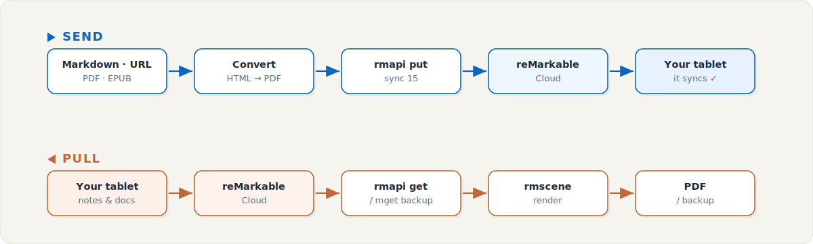

<p align="center">
  
</p>

<p align="center">
  
  
  
  
  
</p>

<p align="center">
  <b>Put anything on your reMarkable — and pull everything back.</b><br>
  Files, web articles and Markdown go <i>in</i>; documents, notebooks and handwritten notes come <i>out</i>.
</p>

---

## Why

The official tools only let you send web pages (the browser extension) or drag files in one by one. This is a tiny, scriptable layer over the reMarkable cloud that:

- 📤 **Sends** local files, **web articles** and **Markdown** — Markdown & web are auto-rendered to clean, screen-sized PDFs (with colour code highlighting).
- 📥 **Pulls** any document back, **backs up** your whole cloud, and **renders handwritten notebooks** to PDF.
- 🖥️ Runs on **macOS & Linux**, works with **any reMarkable** (rM1/2, Paper Pro, Paper Pro Move).
- 🤖 Plugs into [Claude Code](https://docs.claude.com/en/docs/claude-code) as a `/remarkable` skill — just say *"send this to my reMarkable."*

## How it works

<p align="center">
  
</p>

reMarkable only ingests **PDF & EPUB**. So Markdown and web articles are converted to a screen-optimised PDF (HTML → Headless Chrome) before upload. Coming back, handwritten notebooks are stored in reMarkable's `.rm` vector format and rendered to PDF with `rmscene`.

## Quick start

```bash
git clone https://github.com/Oellix/remarkable-toolkit.git
cd remarkable-toolkit
bash scripts/setup.sh          # downloads rmapi, builds the venv, installs the skill
```

**Authenticate once** — grab an 8-character code from
<https://my.remarkable.com/device/browser/connect>:

```bash
echo <CODE> | RMAPI_CONFIG=$PWD/.rmapi.conf bin/rmapi ls
```

> `setup.sh` auto-detects your OS/arch (macOS arm64/intel, Linux amd64/arm64) and fetches the matching `rmapi` binary.

## Sending &nbsp;📤

```bash
PY=.venv/bin/python

$PY scripts/send.py report.pdf                       # PDF / EPUB — sent as-is
$PY scripts/send.py notes.md                         # Markdown → screen-optimised PDF
$PY scripts/send.py notes.md --dest /Reading         # into a cloud folder (auto-created)
$PY scripts/send.py "https://example.com/article" --name "Great read"
```

| Input | What happens |
|-------|--------------|
| `.pdf` / `.epub` | uploaded directly |
| `.md` / `.markdown` / `.txt` | rendered to a clean PDF — headings, tables, colour code |
| `http(s)://…` | article extracted (trafilatura) → Markdown → PDF |

## Pulling &nbsp;📥

```bash
PY=.venv/bin/python

$PY scripts/pull.py list                                 # browse your cloud
$PY scripts/pull.py get "Manual" -o ./                   # one document as .rmdoc
$PY scripts/pull.py backup ./backup                      # recursive backup of everything
$PY scripts/pull.py render "My Notebook" -o note.pdf     # handwriting → PDF
```

## Configuration

| Variable | Default | Purpose |
|----------|---------|---------|
| `RM_PAGE_SIZE` | `100mm 178mm` (Paper Pro Move, 7.3″) | PDF page geometry. Try `157mm 210mm` (rM/rM2) or `179mm 239mm` (Paper Pro). |
| `CHROME_BIN` | auto-detected | Path to Chrome/Chromium, if not found automatically. |

## Good to know

- reMarkable accepts **PDF/EPUB only** — Office docs and images aren't wired up (yet).
- **Handwriting** renders as an **image** (no OCR). On the newest colour devices (Paper Pro / Move) some pages may lose colour or fail to render until `rmscene` catches up to new block types — `render` reports which pages it skipped. Update anytime: `.venv/bin/pip install -U rmc rmscene`.
- **Free tier:** the cloud only keeps notebooks edited in ~the last 50 days; older ones stay on the device (reach them via USB/SSH).
- Your device token lives in `.rmapi.conf` — a secret, kept out of git.

## Built on

[`rmapi`](https://github.com/ddvk/rmapi) · [`rmc`](https://github.com/ricklupton/rmc) · [`rmscene`](https://github.com/ricklupton/rmscene) · [`trafilatura`](https://github.com/adbar/trafilatura) · Headless Chrome

<sub>Personal toolkit · not affiliated with reMarkable AS.</sub>
